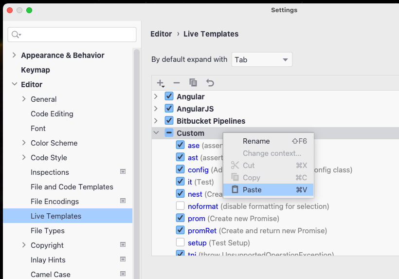

# My IntelliJ Templates

This is a collection of IntelliJ Live Templates and templates for the [Custom Postfix Templates Plugin](https://plugins.jetbrains.com/plugin/9862-custom-postfix-templates).

### Live Templates

To use one of the Live Templates, copy the XML content into your clipboard, then paste (Ctrl-V / Cmd-V) it into the IntelliJ Live Templates settings dialog:



#### [`ast`](./live-templates/ast.xml) AssertJ assertThat...

Expands to:

```java
assertThat(<expression>)
        .<is>(<end>);
```

#### [`ase`](./live-templates/ase.xml) AssertJ assertThat.isEqualTo

Expands to:

```java
assertThat(<expression>)
        .isEqualTo(<end>);
```

#### [`asc`](./live-templates/asc.xml) AssertJ assertThat.containsExactly

Expands to:

```java
assertThat(<expression>)
        .containsExactly(<end>);
```


#### [`tni`](./live-templates/tni.xml) Throw Not Implemented

Expands to:

```java
throw new UnsupportedOperationException("$METHOD_NAME$ is not implemented.");
```

### Custom Postfix Templates

[java-general](./custom-postfix-templates/java-general.postfixTemplates) contains a few postfix template I like to use:

#### `.ast` AssertJ assertThat...

```java
"applesauce".ast
```

Expands to:

```java
assertThat("applesauce")
        .<end>;
```

#### `.ase` AssertJ assertThat.isEqualTo

```java
"applesauce".ase
```

Expands to:

```java
assertThat("applesauce")
        .isEqualTo(<end>);
```

#### `.asc` AssertJ assertThat.containsExactly

```java
List<String> fruit = List.of("Apple", "Banana");
fruit.asc
```

Expands to:

```java
List<String> fruit = List.of("Apple", "Banana");
assertThat(fruit)
        .containsExactly(<end>);
```

#### `.toMap` Map Stream Collector

```java
List<String> fruit = List.of("Apple", "Banana");
fruit.toMap
```

Expands to:

```java
List<String> fruit = List.of("Apple", "Banana");
fruit.stream().collect(toMap(
  e -> <key>,
  e -> <value>
));
```

#### `.lof` Wrap Expression in List.of()

```java
"Carrot".lof
```

Expands to:

```java
List.of("Carrot")
```

#### Ted Young's Postfix Templates

In addition to these I also import [Ted's Postfix Templates](https://github.com/jitterted/custom-postfix-templates) for the `.nv` _New Variable_ template.

```java
Game.nv
```

Expands to:

```java
Game <end> = new Game();
```
